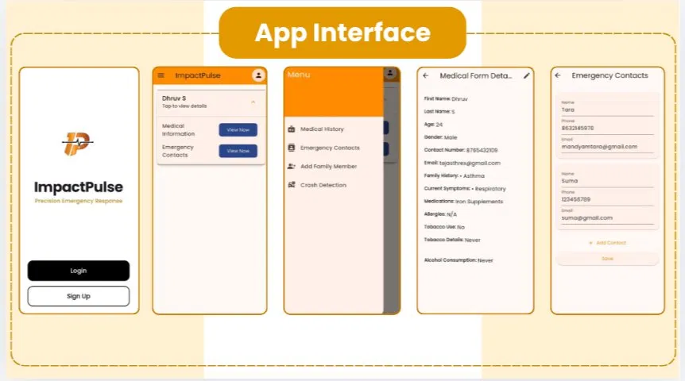

# ImpactPulse 
ImpactPulse is a mobile application designed to streamline emergency response by giving first responders and bystanders immediate access to a person's critical medical information. Built with crash detection at its core, ImpactPulse automatically alerts emergency contacts the moment an incident is detected, no manual action required.

## Application Interface




---

## Features

- **Medical Profile Management** — Store and manage personal medical history including family history, current symptoms, medications, allergies, and lifestyle data.
- **Emergency Contact Management** — Add and manage multiple emergency contacts, each with name, phone, and email.
- **Automated Email Alerts** — Sends real-time notifications to emergency contacts via asynchronous SMTP email services when a crash is detected.
- **Secure Data Storage** — Medical data is stored securely using Supabase and PostgreSQL with multi-profile support.

### Installation

```bash
git clone https://github.com/tara05ma/Impact-Pulse-
cd impact_pulse
flutter pub get
```
